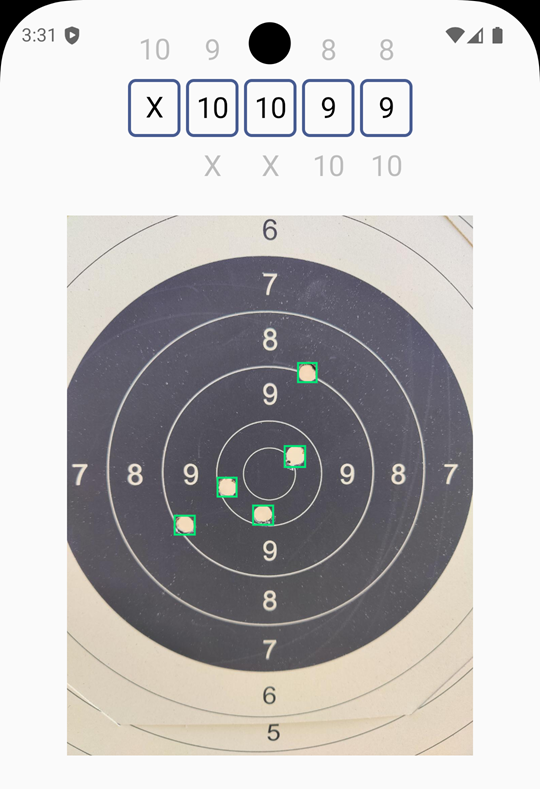

# Markera

En **Kotlin Multiplatform**- + **Compose Multiplatform**-app för Android och iOS
som automatiskt poängsätter serier i precisionsskytte från en bild av tavlan.



## Mål med appen

Att **poängsätta serier i precisionsskytte automatiskt** via en Android- och
iOS-app, och sedan spara dem till en lokal databas och eventuellt en backend
([webshooter](https://github.com/)). Resultaten ska kunna exporteras och delas
till CSV, Excel m.m.

## Lösningsförsök

### 1. Träna modellen på hål

Träna modellen att detektera hål, och räkna poäng utifrån avståndet mellan
"mitten" och 6:e/7:e ringen.

**Resultat:** Fungerar dåligt. Detekteringen av mitten är väldigt skakig och
hamnar nästan alltid fel, vilket leder till felaktiga poäng. Även detekteringen
av 6:e–7:e ringen skulle behöva förbättras.


### 2. Träna modellen att markera poäng

Träna modellen att markera poäng direkt, inte bara hål.

**Resultat:** Fungerade bra på verifieringsdatan, men dåligt i praktiken. Ett
större träningsdataset skulle eventuellt hjälpa, men det är svårt att skapa och
väldigt tidskrävande. Framför allt de lägre poängen — som är ovanligare i
träningsdatan — fick mer eller mindre slumpmässig poängsättning.


### 3. Träna modellen på hål + geometrisk mitt (pågående)

Träna modellen på hål (ingen "vibe-kodning"), detektera siffrorna och dra två
linjer — en vertikal och en horisontell — så att de passerar genom mitten på så
många sifferboxar som möjligt. Skärningspunkten för dessa linjer är ellipsens
centrum.

**Resultat:** Okänt — implementationen pågår.


## Teknisk översikt

Appen är ett enda `:composeApp`-KMP-modul med `commonMain`, `androidMain` och
`iosMain`. Håldetekteringen körs med en YOLOv8 ONNX-modell. Poäng matas idag in
manuellt via väljarna på skärmen.

### Bygga för Android

ONNX-modellen `best.onnx` (~99 MB) är **inte** incheckad i repot. Lägg den i
`composeApp/src/androidMain/assets/best.onnx` innan du bygger.

Appen har två produktflavors:

- **`camera`** — appen som levereras; live CameraX-förhandsvisning från
  baksideskameran.
- **`mock`** — en emulator-/utvecklingsflavor som fejkar kameran genom att spela
  upp ett slumpmässigt urval av dataset-bilder. Detektering körs automatiskt på
  varje inläst bild.

```sh
./gradlew :composeApp:installCameraDebug   # riktig kamera, på en enhet
./gradlew :composeApp:installMockDebug     # emulator, ingen kamera behövs
```

### Köra tester

```sh
./gradlew :composeApp:testDebugUnitTest
```

### iOS

`HoleDetector` är för närvarande en stub på iOS (returnerar inga detekteringar).
Följ `iosApp/README.md` för att skapa ett Xcode-projekt som använder det delade
ramverket.
